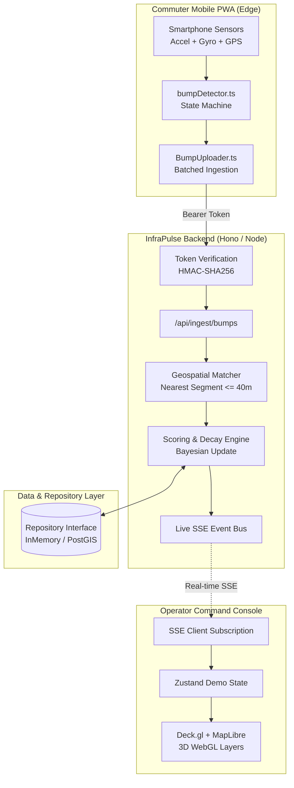

<div align="center">

# 🛣️ InfraPulse

**Predictive Road Condition Monitoring & Infrastructure Intelligence Platform**

[](https://infrapulse-nu.vercel.app)
[](https://react.dev)
[](https://www.typescriptlang.org)
[](https://vitejs.dev)
[](https://tailwindcss.com)
[](https://hono.dev)
[](https://vitest.dev)

<p align="center">
  <em>Every commuter smartphone is a sensor: real-time accelerometer and gyroscopic telemetry turns vehicular bumps into sub-50m road condition scores, projects degradation 90 days forward, and solves for optimal public works budget allocations.</em>
</p>

[**Explore Live Demo**](https://infrapulse-nu.vercel.app) • [**Command Console**](https://infrapulse-nu.vercel.app/command) • [**Driver Web App**](https://infrapulse-nu.vercel.app/app) • [**Architecture**](#-system-architecture) • [**Quickstart**](#-getting-started)

</div>

---

## ⚡ Overview

Road networks usually deteriorate invisibly until sudden potholes cause severe vehicular damage and safety hazards. Municipal inspections are historically manual, reactive, and expensive.

**InfraPulse** shifts municipal road management from reactive repair to **predictive triage**:

- **Sensor Crowdsourcing**: Captures road shock profiles directly from standard smartphone hardware via web-standard APIs (`DeviceMotionEvent` + `GeolocationCoordinates`).
- **Sub-50m Geospatial Discretization**: Slices road networks (e.g., Chandigarh University / Gharuan network with 1,100+ OSM segments) into 50-metre discretized segments scored from 0 (failed) to 100 (pristine).
- **Forward Decay Modelling**: Projects degradation trends 30, 60, and 90 days out, incorporating monsoon moisture factors and road arterial classifications.
- **Budget Optimization**: Implements an algorithmic greedy knapsack solver that ranks road repairs by **risk removed per rupee (₹)** to maximize return on public capital expenditure.
- **Automated Authority Routing**: Prepares targeted, corroborated escalation briefs formatted for jurisdictional agencies (NHAI, State PWD, Municipal Corporations).

---

## 🌟 Key Features

### 1. 🎛️ Command Console & 3D Geospatial Twin (`/command`)

- **Deck.gl + MapLibre GL Integration**: Renders real-time 3D road status polygons, extruded 3D risk towers, and live ripple pulse rings when vehicular impacts occur.
- **Cinematic Inspection Camera**: Two-stage animated camera transitions that tilt, elevate, and focus onto queried road defects without losing geospatial orientation.
- **Live Waterfall Scoring Analysis**: Interactive segment drawer dissecting structural decay, traffic weight, recent shocks, and predicted failure dates.

### 2. ⏳ Predictive Time Machine (`/forecast`)

- Interactive 90-day time slider visualizing projected city-wide decay before it occurs.
- Side-by-side comparative simulation: **"Do Nothing"** vs. **"Execute Priority Plan"**.

### 3. 💰 Algorithmic Budget Optimizer (`/budget`)

- Dynamic capital allocation slider using a greedy knapsack algorithm.
- Live ROI curve illustrating percentage of network hazard risk eliminated for every additional ₹1,00,000 allocated.
- One-click bulk work-order generation for funded segments.

### 4. 📋 Kanban Work-Order Tracking (`/work-orders`)

- 5-stage lifecycle state machine: `Draft` → `Approved` → `In Progress` → `Completed` → `Verified`.
- Post-repair validation showing real before-and-after bump frequency improvements.

### 5. 📱 Driver Edge App & PWA (`/app`)

- **Zero-Install Mobile Experience**: Installable Progressive Web App with offline service worker precaching.
- **Real-Time Sensor Telemetry**: Live seismograph, speed vector gauge, and 3D device orientation cube.
- **Edge Pothole Capture**: Secure camera integration (`getUserMedia`) with real-time detection bounding boxes and severity grading (`/app/report`).

---

## 🏛️ System Architecture



---

## 🛠️ Technology Stack

| Layer                     | Technologies                                                             |
| ------------------------- | ------------------------------------------------------------------------ |
| **Frontend Framework**    | React 19, TypeScript 5, Vite 8                                           |
| **3D & Geospatial**       | Deck.gl 9.4, MapLibre GL 6.11, React Map GL, Three.js, React Three Fiber |
| **UI & Styling**          | Tailwind CSS v4, Motion (Framer Motion 13), Lucide Icons, Sonner         |
| **State & Data Fetching** | Zustand 5, TanStack Query 5                                              |
| **Backend Framework**     | Hono 4, Node.js HTTP Server, Server-Sent Events (SSE)                    |
| **Validation & Security** | Zod 4, Node Crypto (HMAC-SHA256 Token Minting)                           |
| **Offline & PWA**         | Vite PWA Plugin, Workbox, Service Workers, Web Manifest                  |
| **Testing & Quality**     | Vitest 5, Testing Library, Playwright, Oxlint, Prettier                  |
| **Hosting & Deployment**  | Vercel (Edge CDN, Single-Page App Rewrites, Hardware Security Headers)   |

---

## 🚀 Getting Started

### Prerequisites

- **Node.js**: `v20.x` or higher (`v22+` recommended)
- **npm**: `v10.x` or higher

### 1. Clone & Install

```bash
git clone https://github.com/sumitkumarraju/infrapulse.git
cd infrapulse

# Install frontend dependencies
npm install

# Install server dependencies
cd server && npm install && cd ..
```

### 2. Standalone Frontend (Deterministic Mock)

InfraPulse features a deterministic mock layer seeded with authentic OpenStreetMap geometries around Chandigarh University. No database or external server is required for full demonstration mode:

```bash
npm run dev
```

Open **[http://localhost:5173](http://localhost:5173)** in your browser.

> **Tip:** Add `?demo=1` to any URL (e.g. `http://localhost:5173/command?demo=1`) to activate the **Presenter Remote** for simulated vehicular drives, accelerated time-jumps, and guided camera tours.

### 3. Running with Live Backend API

To connect the frontend to the live Hono API server:

```bash
# Terminal 1: Launch API server
cd server
npm run dev
# Server starts at http://localhost:8787

# Terminal 2: Launch Frontend with API target
cd ..
VITE_API_URL=http://localhost:8787 npm run dev
```

---

## 🔐 Environment Configuration

Create a `.env` file in the root directory (based on `.env.example`). The repository ignores `.env` by default to prevent secret leakage.

| Variable              | Description                                                            | Default / Example                            |
| --------------------- | ---------------------------------------------------------------------- | -------------------------------------------- |
| `PORT`                | API Server Port                                                        | `8787`                                       |
| `NODE_ENV`            | Runtime environment (`development` / `production`)                     | `production`                                 |
| `DEVICE_TOKEN_SECRET` | 64-char HMAC secret used to sign anonymous mobile device ingest tokens | _Auto-generated hex_                         |
| `SESSION_SECRET`      | 64-char secret for signing operator session cookies                    | _Auto-generated hex_                         |
| `OPERATOR_PASSWORD`   | Access credential for engineer dashboard                               | _Secure password_                            |
| `CORS_ORIGINS`        | Permitted cross-origin endpoints                                       | `http://localhost:5173,https://*.vercel.app` |
| `DATABASE_URL`        | Optional PostgreSQL / PostGIS connection URI                           | `postgresql://...`                           |

---

## 🧪 Testing & Verification

The codebase maintains rigorous quality gates with unit, integration, and end-to-end coverage:

```bash
# Run unit & integration tests (61 tests)
npm test

# Run server test suite (33 tests)
cd server && npm test && cd ..

# TypeScript strict typechecking
npm run typecheck

# Fast linter audit
npm run lint

# Production bundle compilation
npm run build

# Run Playwright E2E suites (optional)
npm run e2e
```

---

## 🌐 Production Deployment

The web application is pre-configured with a production-grade [`vercel.json`](./vercel.json) featuring:

- **SPA Rewrites**: Handles deep routing (`/command`, `/forecast`, `/app`) without 404 errors.
- **Hardware Permission Policies**: Explicitly permits `geolocation`, `accelerometer`, and `gyroscope` APIs on secure HTTPS origins.
- **Immutable Asset Caching**: 1-year cache headers for static bundles and MapLibre tile assets.

To deploy via Vercel CLI:

```bash
npm install -g vercel
vercel deploy --prod
```

---

## 📄 License

This project is licensed under the [MIT License](LICENSE).

<div align="center">
  <sub>Built with ❤️ for resilient, intelligent infrastructure.</sub>
</div>
